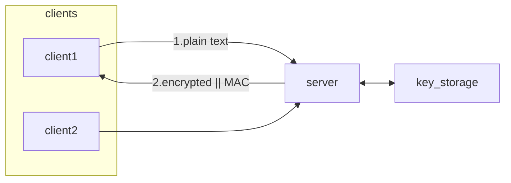

# Crypto Server




## Build

Pull the submodules:

```sh
git submodule update --init --recursive
```

Create build directory.

```sh
mkdir build
cd build
```

Build the server.

```sh
cmake ..
make crypto_server
```

## Run

```sh
./crypto_server
```
